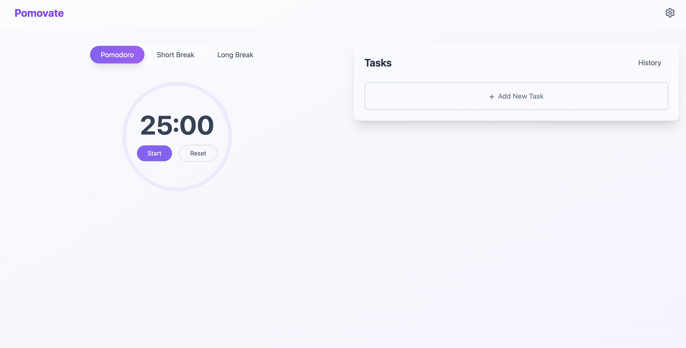

# Pomovate

Pomovate is a Pomodoro timer that helps you stay focused and productive. It is a simple and easy-to-use app that helps you manage your time and tasks effectively. With Pomovate, you can set a timer for your work sessions and breaks, track your progress, and stay motivated to achieve your goals.

## Features

- Set a timer for your work sessions and breaks
- Track your progress and stay motivated
- Customize your work and break intervals

